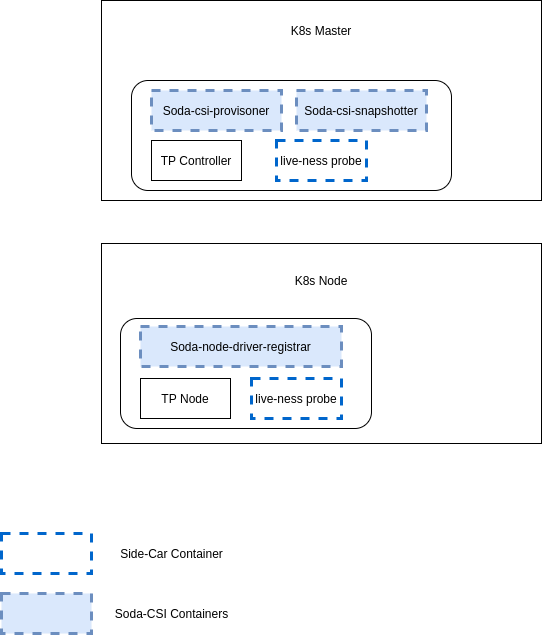

# SODA-CSI Plugin

This plugin facilitates the provisioning of the Storage using heterogeneous CSI Storage drivers in Kubernetes.

## Goals
 - Make a SODA-CSI plugin which helps to provision and manage the Storage of hetrogeneous Storage providers using the single CSI plugin.
 - Third party CSI drivers should be used directly from Vendors so that SODA/Users need not worry about it's maintenance.
 - The SODA-CSI plugin should use Soda Profile ID to determine which storage vendor drivers need to be used to provision the storage.
 - The SODA-CSI plugin should help users to provision the storage using thrid party drivers and also experience all the features set of SODA.
 
 
 ## Proposed Architecture
 
 
 
 ### Deployment View
 
 
 ### Call FLows
 
