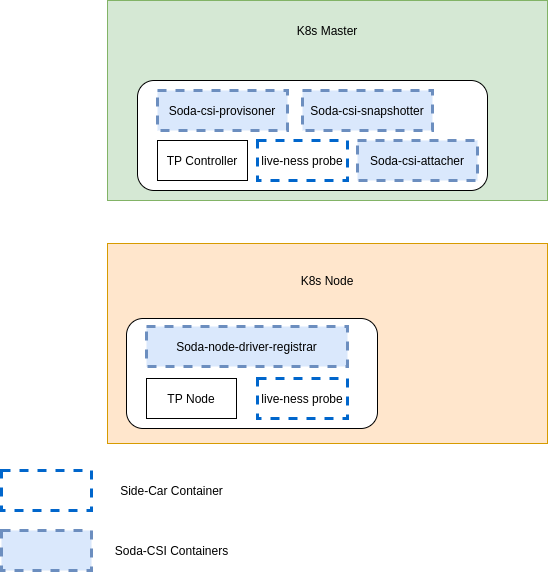
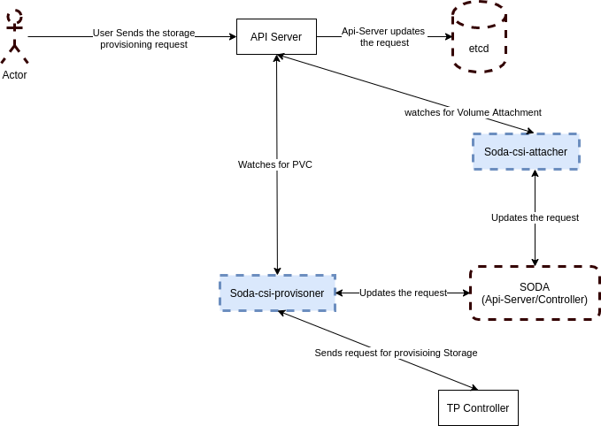

# SODA-CSI Plugin

This plugin facilitates the provisioning of the Storage using heterogeneous CSI Storage drivers in Kubernetes.

## Goals
 - Make a SODA-CSI plugin which helps to provision and manage the Storage of hetrogeneous Storage providers using the single CSI plugin.
 - Third party CSI drivers should be used directly from Vendors so that SODA/Users need not worry about it's maintenance.
 - The SODA-CSI plugin should use Soda Profile ID to determine which storage vendor drivers need to be used to provision the storage.
 - The SODA-CSI plugin should help users to provision the storage using thrid party drivers and also experience all the features set of SODA.
 
 
 ## Proposed Architecture
 
 The goal is to make the SODA CSI plugin which can help to use the ThirdParty Storage CSI drivers in SODA way and get all the advantages of SODA frameworks.  
 This will help the users to use hetrogeneous storage backends using a unified way provided by SODA.
 ~~~
apiVersion: storage.k8s.io/v1
kind: StorageClass
metadata:
  name: csi-soda-example--block
provisioner: csi-soda-block                 # This is the provisioner provided by SODA
parameters:
  attachMode: rw
  profile: XXXXXXXXXXXXXXXXXXXXXXXXXXXX     # This profile will help to use the hetrogeneous storage backend in a similar way
 ~~~
 
 ### Deployment View
 
 
 ### Call FLows
 
 
 ### Known Challenges
  - How to determine the plugin capabilitie when hetrogeneous drivers are there with different capabilities.
  
